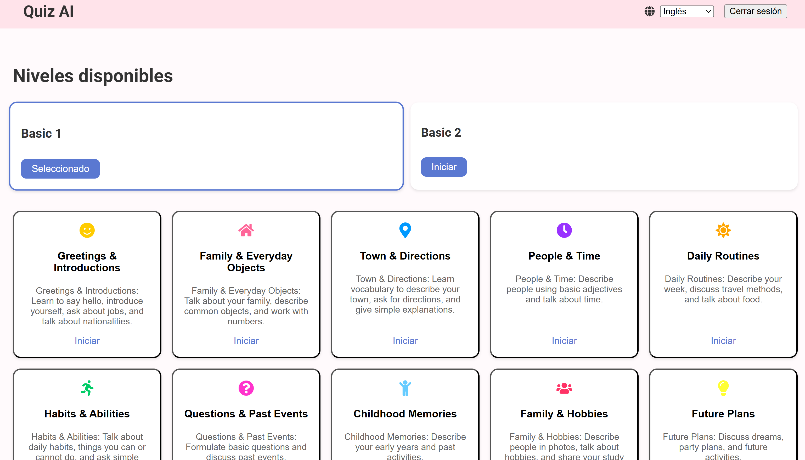
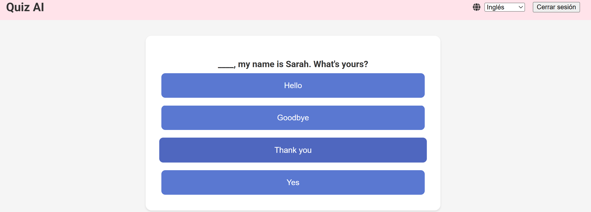

# Quiz English IA

## About the Project
This project generates quiz questions using AI based on the topic you want to learn. It is designed to help users improve their English skills interactively.

## Features
- Responsive design
- Lazy loading for components
- Optimized API handling with Axios

## Updated Installation
1. Clone the repository.
2. Run `npm install` to install dependencies.
3. Create a `.env` file with the following content:
   ```env
   REACT_APP_API_URL=http://localhost:5000
   ```
   - Replace `http://localhost:5000` with your API URL if different.
4. Run `npm start` to start the development server.

## API Integration
This project uses an API for fetching quiz questions and handling authentication. Ensure the backend API is running and accessible at the URL specified in the `.env` file.

## Deployment
This project can be deployed on platforms like Vercel or Netlify. Ensure the `.env` file is configured correctly for production.

## Demo
[Live Demo](https://quiz-english-ia.vercel.app/)

## Screenshots



## Portfolio Highlight
This project is a showcase of my skills in building interactive web applications using modern technologies. It demonstrates my ability to:

- Develop responsive and user-friendly interfaces.
- Integrate AI-powered features to enhance user experience.
- Implement efficient state management and API handling.
- Deploy applications on platforms like Vercel or Netlify.

Feel free to explore the code and reach out if you have any questions or opportunities!